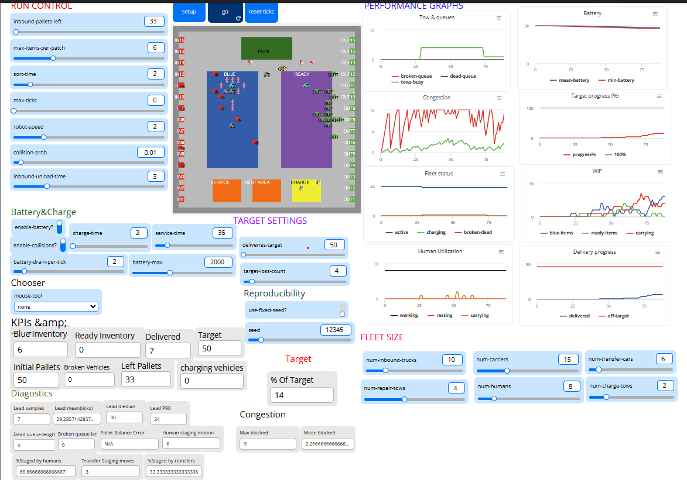

# 📦 Agent-Based Sortation Warehouse Simulation
### Human–Robot Coordination in NetLogo Web

> A warehouse simulation where inbound trucks, transfer vehicles, outbound carriers, humans, and recovery fleets operate together under congestion, blocking, battery, and reliability constraints.

---

## 🚀 Overview
This project presents an **agent-based sortation warehouse simulation** built in **NetLogo Web**. It models how pallets move through a warehouse from **inbound unloading** to **sorting/staging** and finally to **outbound dispatch**.

The model is designed to explore how real operational constraints affect performance, including:

- corridor congestion  
- blocking and traffic conflicts  
- collision risk  
- battery depletion and charging downtime  
- breakdowns and towing recovery  
- human–robot coordination  
- throughput and delivery targets  

Instead of treating the warehouse as one average system, the simulation represents each worker and vehicle as an **independent agent** interacting with shared space and warehouse rules.

---

## ✨ Key Features

- **📥 End-to-end warehouse flow**: inbound → BLUE → READY → outfeed  
- **🤖 Multi-agent warehouse system** with 6 agent types  
- **👷 Human–robot collaboration** in shared operational space  
- **⚡ Battery, charging, and downtime logic**  
- **🛠️ Recovery workflow** for broken and dead vehicles  
- **🚧 Congestion and blocking analysis**  
- **📊 Live plots and performance monitors**  
- **🧠 Fair movement coordination** using `plan → resolve → commit`  

---

## 🧩 Agent Types

The model includes:

- **Inbound Trucks** — unload pallets into the system  
- **Transfer Cars** — move pallets from **BLUE** to **READY**  
- **Outbound Carriers** — move pallets from **READY** to **OUTFEED**  
- **Humans** — support sorting and handling work  
- **Repair Tows** — recover broken vehicles  
- **Charge Tows** — recover battery-depleted vehicles  

---

## 🏭 Warehouse Zones

The warehouse layout includes:

- **INFEED**
- **BLUE** — staging / sorting zone  
- **READY** — ready-to-ship buffer  
- **OUTFEED**
- **SERVICE**
- **CHARGE**
- **PARK / charge-lot**
- **REST**

These zones create realistic movement pressure, bottlenecks, and recovery behaviour inside the warehouse.

---

## ⚙️ How the Model Works

### 1. Inbound Unloading
Inbound trucks unload pallets into the **BLUE** zone.

### 2. Sorting and Staging
Humans and transfer cars work together to move pallets from **BLUE** to **READY**.

### 3. Outbound Dispatch
Outbound carriers collect pallets from **READY** and deliver them to **OUTFEED**, increasing completed deliveries.

### 4. Movement Coordination
To avoid unfair ordering and unstable agent movement, the model uses:

`plan → resolve → commit`

This makes movement more stable when many agents attempt to use the same shared corridors.

### 5. Recovery Logic
If collisions or battery depletion occur, vehicles may be queued, towed, repaired, charged, and returned to operation.

---

## 🎛️ Main Controls

### Buttons
- `setup`
- `go`
- `reset-ticks`

### Important Sliders
- `inbound-pallets-left`
- `deliveries-target`
- `robot-speed`
- `collision-prob`
- `sort-time`
- `battery-drain-per-tick`
- `charge-time`
- `service-time`

### Switches
- `enable-battery?`
- `enable-collisions?`
- `use-fixed-seed?`

### Interactive Chooser
- `mouse-tool`

---

## 📈 Performance Monitoring

The model tracks warehouse performance using monitors and plots such as:

- **Blue Inventory**
- **Ready Inventory**
- **Delivered**
- **% Of Target**
- **Mean blocked / Max blocked**
- **Broken Vehicles**
- **Charging Vehicles**
- **Lead-time statistics**

### Plots Included
- **Delivery progress**
- **WIP**
- **Congestion**
- **Fleet status**
- **Battery**
- **Tow & queues**
- **Human Utilization**
- **Target progress (%)**

---

## 🧪 Example Scenarios

The report supports scenario-based testing such as:

- **Baseline flow**
- **Inbound overload**
- **Outbound bottleneck**
- **Congested layout**
- **Battery stress + towing**

These scenarios help reveal where throughput is being limited:

- rising **BLUE** inventory suggests transfer/sorting pressure  
- rising **READY** inventory suggests outbound pressure  
- rising congestion suggests layout and traffic conflicts are the problem  

---

## ▶️ How to Run

1. Open `SortationWarehouseModel.nlogox`
2. Click **setup**
3. Adjust sliders and switches
4. Click **go**
5. Observe deliveries, WIP, congestion, and recovery behaviour
6. Use `mouse-tool` to create stress scenarios or interactive interventions

---

## 🔍 What This Project Shows

This simulation demonstrates that warehouse performance is shaped by more than just adding more robots or workers.

Important insights include:

- throughput depends on **balanced capacity across stages**
- congestion can reduce performance even with enough vehicles
- reliability events create hidden operational costs
- charging, service stations, and towing resources directly affect flow
- human–robot coordination matters in shared spaces

---

## 📌 Business Insights

This model shows that warehouse performance is not improved simply by adding more robots or workers. Throughput depends on **balanced capacity across all stages** of the workflow: inbound unloading, sorting/transfer, and outbound dispatch.

A key operational insight is that **WIP location helps diagnose bottlenecks**:

- rising **BLUE** inventory suggests pressure in inbound handling, sorting, or transfer capacity  
- rising **READY** inventory suggests outbound dispatch is the limiting stage  

The simulation also highlights that **congestion is a hidden operational cost**. Shared corridors, blocking, and traffic conflicts can reduce throughput even when enough vehicles are available. In some situations, increasing fleet size without improving movement rules or layout can actually worsen performance.

Another important business insight is that **reliability affects flow beyond the failed vehicle itself**. Battery depletion, breakdowns, and collision events create secondary delays through towing, charging, servicing, and temporary blockage of shared space.

**Management takeaway:** warehouse efficiency depends on **smooth flow, balanced capacity, and fast recovery**, not just higher automation volume.

---

## 📊 Final Results

### Sample Run Summary
- **Final Deliveries:** 50
- **Effective Delivery Target:** 50
- **Ticks to Target:** 2006
- **Average Congestion:** 2.592
- **Peak Congestion:** 10
- **Peak Dead Vehicles:** 0
- **Peak Broken Vehicles:** 0

### Interpretation
The model successfully reached the effective target while maintaining manageable congestion and no peak dead or broken vehicle events in this sample run. The results suggest that the system can achieve stable throughput when flow across inbound, transfer, and outbound stages remains balanced.

Across scenario testing, the model also showed that:

- overload at the inbound side causes **BLUE** accumulation  
- limited outbound capacity causes **READY** accumulation  
- congestion and blocking can slow deliveries even when inventory is available  
- recovery processes such as charging and towing are important for maintaining flow under stress  

These results support the project objective of using agent-based simulation to identify bottlenecks, understand warehouse behaviour, and explore operational improvements before applying changes in real systems.

---

## 🛣️ Future Improvements

Possible future extensions include:

- richer routing logic  
- conveyor or sorter integration  
- pallet-level priority rules  
- cost and energy modelling  
- stronger experimental benchmarking  
- digital-twin-style warehouse analysis  

---

## 🤝 Collaboration

I’m open to collaboration, feedback, and discussion in areas such as:

- agent-based modelling  
- NetLogo simulation  
- warehouse logistics  
- human–robot coordination  
- operational analytics  
- AI-driven decision support  

---

## 👨‍💻 Author

**Harish Ulaganathan Indhumathi**  
**BSc Artificial Intelligence**
